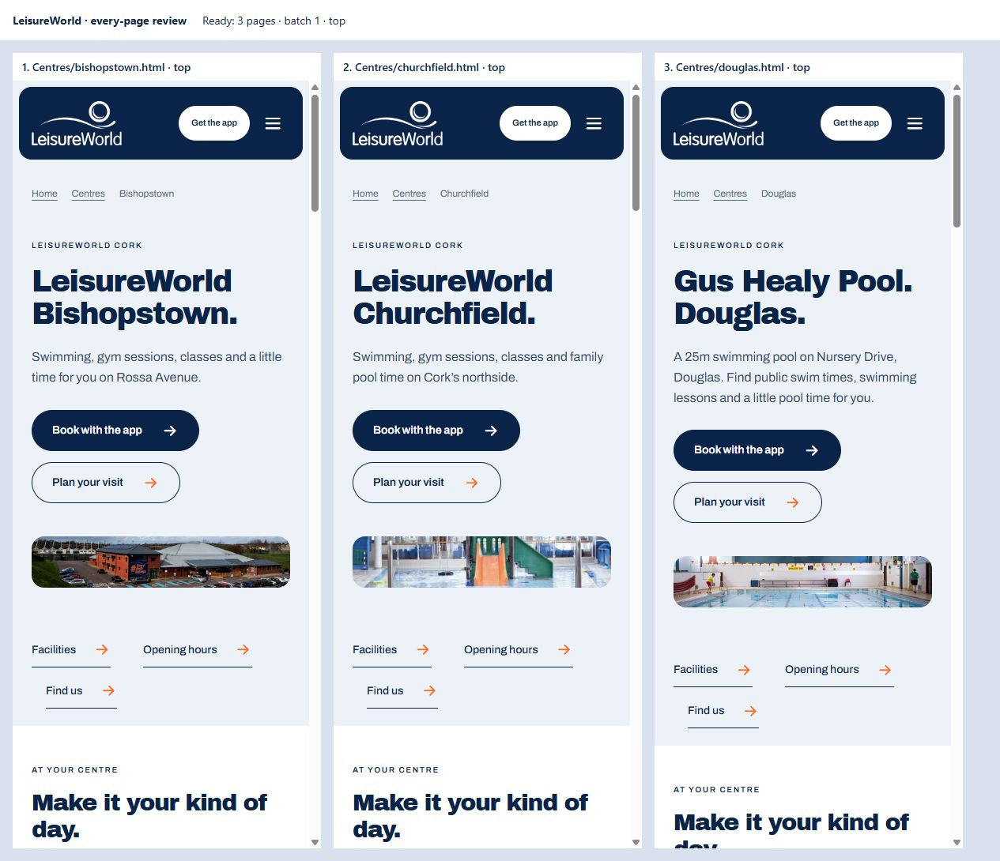
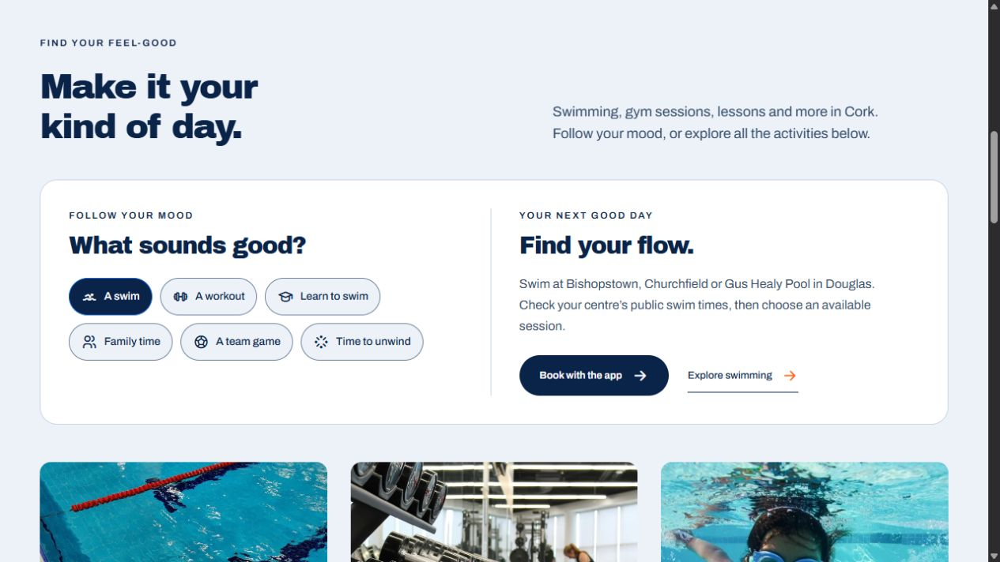
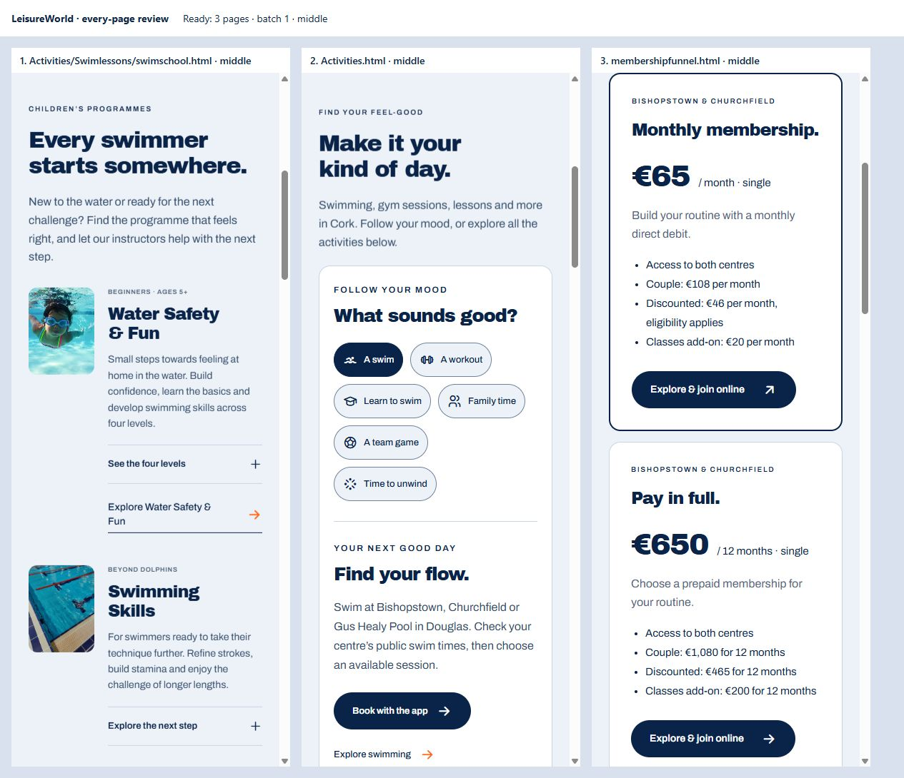

# Whole-site design, accessibility and discovery review

**Follow-up:** The user subsequently identified weak visual design, including
Swim School, and reconfirmed that all pages needed review. The visual conclusions
below are superseded by the [new every-page refinement](design-refinement-review.md),
which records 30 further page changes and fresh checks of all 38 pages.

Completed locally on 12 September 2026. All **38 public pages** were reviewed and refined around the approved homepage and lighter centre design. App bookings remain the main conversion priority. Memberships, lesson assessments, training enquiries, policy reading and support keep the next step appropriate to the visitor’s task.

## Visitor flows checked

1. **Discover and book:** homepage → app section → verified App Store / Google Play links, with browser booking available.
2. **Choose an activity:** activity directory → six mood choices → relevant centre/activity details or booking. Lessons lead to assessment or adult courses.
3. **Plan a visit:** centres directory → consistent centre page → facilities, current schedule, admission/access information, directions and app.
4. **Choose a membership:** prices → monthly, prepaid or Douglas plan → online joining or Douglas reception. A single visit remains an option.
5. **Start lessons or training:** programme directory → suitability and requirements → assessment, current course listing or targeted enquiry.
6. **Resolve a question:** help search/category → answer or contact → labelled form and meaningful failure/success feedback. Policies have readable HTML, contents links and assistance.

## Findings resolved

| Priority | Evidence and issue | Resolution |
| --- | --- | --- |
| High | Douglas used a different hero treatment from the approved light centre pages; its app copy also advertised gyms/classes on a pool-only page. | Same light introduction, panorama and visit structure as the other centres; Douglas-specific swim and enquiry guidance. |
| High | Centre hero buttons prioritised facilities even though app bookings are the requested main conversion. | Primary “Book with the app”, secondary “Plan your visit” on all three. |
| High | Prepaid membership sent visitors back to prices instead of providing a joining step. | Online sign-up action plus secondary duration comparison. |
| Medium | The activity directory required visitors to interpret generic categories. | A six-choice decision aid connects intent to relevant locations and a concrete next step. All original directory routes remain available. |
| Medium | Programme detail pages were poorly connected to the Swim School cards and several used the same beginner photograph. | Visible programme links, contextual breadcrumbs and distinct Rookie/Skills imagery. |
| Medium | Adjacent buttons and text links could appear joined together; some inline links relied on colour alone. | Shared action spacing and explicit inline-link underlining. |
| Medium | One consumer-rights link returned HTTP 404. | Updated the terms page to the current CCPC guidance page. |
| Medium | Directory/course content lacked specific structured relationships; file rewrites could imply fresh content dates. | Visible-content-based ItemList/Course data, hierarchical breadcrumbs and removal of misleading automatic sitemap dates. |
| Low | Policies lacked a convenient return action at the end of the document. | Added “All policies” beside the assistance route without changing approved policy wording. |

The earlier design and the unchanged pages were also reviewed, not replaced merely to create a diff. The consistent palette, Archivo typography, photography, native disclosures and restrained motion remain intact.

## Reviewed screenshots

The screenshots below are from the actual local pages in this review. The three-column phone images use 390px layout frames; the desktop activity image is a direct page capture.

### App-first centre pages

### Activity choices lead to a next step

### Programme and membership paths on mobile

Additional accepted captures: [programme imagery](review-images/after-programme-heroes.png) and [homepage app funnel](review-images/verified-home-app-funnel.png). The complete local before/top/content/end capture set is in `.impeccable/full-review/captures/` (excluded from deployment and Git). Two off-screen iframe hero images initially failed to paint in a gallery capture; direct and visible-row captures confirmed the real images and supersede those gallery regions.

## Accessibility and functional verification

- **304 checks:** 38 pages × widths 1267, 768, 390 and 320, repeated with WCAG text spacing (line height 1.5, letter spacing .12em, word spacing .16em, paragraph spacing 2em).
- **7 additional checks:** all six activity recommendation states at 320px with expanded spacing, plus the final terms-link change.
- **Zero detected axe rule violations or layout/image flags** in those runs. Disclosures were expanded for the automated checks. Native scrollbars reduce the available inner width; wide data tables scroll inside their labelled regions.
- Static checks: **38 pages, 2,369 local references, zero errors**, including image variants, filename case, fragments, IDs, form labels and JSON-LD parsing.
- All six activity choices, five gym filter states, help search/reset/empty state, native disclosure, menu opening/Escape/focus return and homepage-to-app navigation were exercised.
- The contact form was tested with local simulated responses. Invalid inputs expose an error summary, failure retains the form and offers email, and confirmed success resets it. **15 PHP response/validation cases passed with real mail disabled.**
- Activity and help pages were rendered with scripts blocked: all three main activity cards and all 16 help answers remain available.
- JavaScript syntax and Git whitespace checks passed.

Axe reported manual-review items for the closed modal’s `aria-controls` relationship, text over photography and the cropped footer logo. The menu target exists and opening/dismissal/focus return were checked. The shared 60% dark hero overlay gives at least **5.03:1 for white** and **4.55:1 for the light supporting text**, even over white image pixels. The footer caption has an explicit light-on-navy treatment and sits below the visibly clipped logo. These checks are not a complete assistive-technology evaluation.

The implementation target is **WCAG 2.2 AA**. The website statement continues to make no full-conformance claim. Applicable legal scope, complete EN 301 549 requirements, screen-reader/speech-input testing, disabled-user testing, actual browser/text zoom and the external booking/payment journey still require evaluation. See the [accessibility review](accessibility-review.md) and [W3C standard](https://www.w3.org/TR/WCAG22/).

## AI search and content discovery

Public facts remain in static, readable HTML: named centres, facility differences, programme suitability, prices, policies and booking instructions. Every public page has a unique title/description, canonical URL, social metadata and a consistent organisation/site identity. Visible breadcrumbs and structured breadcrumbs now agree. Five directories have matching ItemList data and five course detail pages have Course data; no fictitious schedules, reviews, ratings, offers or live availability were added.

The sitemap includes all 38 public pages. Metadata generation now avoids unchanged HTML writes and no longer treats file modification times as content-review dates. The optional `llms.txt` directory and OAI-SearchBot access remain. These support discovery and interpretation; they do not guarantee indexing, citations or ranking. Google requires no special AI-only schema/file. [Google AI search guidance](https://developers.google.com/search/docs/appearance/ai-features), [OpenAI crawler guidance](https://developers.openai.com/api/docs/bots), [Google sitemap guidance](https://developers.google.com/search/docs/crawling-indexing/sitemaps/build-sitemap).

## Every-page coverage

Each row received a rendered design review and the eight responsive/spacing checks above. “Reviewed” means retained where the existing design and purpose already worked. The linked structured results preserve every automated run.

| Page | Visitor task | Appropriate next step | Review / change |
| --- | --- | --- | --- |
| [about.html](../about.html) | Understand LeisureWorld’s community role | Choose a centre | Retained the community story and centre CTA; added visible breadcrumb and clearer action spacing. |
| [accessibility.html](../accessibility.html) | Plan facility access or understand the Functional Zone | Contact a centre or discuss the HSE referral route | Reviewed physical-access guidance, centre contacts and the HSE referral distinction. Preserved the appropriate assistance route. |
| [Activities/Swimlessons/rl.html](../Activities/Swimlessons/rl.html) | Explore junior lifesaving skills | Book an assessment | Replaced the generic beginner image with Rookie Lifeguard imagery; added parent breadcrumbs and Course data; assessment and age 8–14 facts remain clear. |
| [Activities/Swimlessons/ss.html](../Activities/Swimlessons/ss.html) | Understand advanced swimming progression | Book an assessment or discuss progression | Added swimming-specific imagery, parent breadcrumbs and Course data; retained progression and assessment guidance. |
| [Activities/Swimlessons/swimschool.html](../Activities/Swimlessons/swimschool.html) | Choose a children’s lesson starting point | Book a free assessment | Connected all three programme cards to their detail pages; added visible hierarchy and matching directory data. Kept assessment and existing-parent paths distinct. |
| [Activities/Swimlessons/wsf.html](../Activities/Swimlessons/wsf.html) | Understand the beginner swimming programme | Book an assessment | Added parent breadcrumbs and Course data; preserved beginner ages 5+, four levels, assessment and parent questions. |
| [Activities.html](../Activities.html) | Choose an activity | Swimming, gym/classes or lessons | Added six accessible mood choices with contextual booking/lesson actions, location guidance and a live announcement. Kept all normal directory links. Added matching ItemList data. |
| [adultswimlesson.html](../adultswimlesson.html) | Choose adult or individual swimming lessons | Check courses or contact the teaching team | Reviewed beginner, improver and individual lesson routes; added swimming breadcrumbs and better separation between course and enquiry actions. |
| [appfunnel.html](../appfunnel.html) | Get set up to book on a phone | Download the app or open browser booking | Reviewed store badges, iPhone image, setup steps, browser alternative and lesson FAQ. Verified both store destinations respond. |
| [careers.html](../careers.html) | Explore working with LeisureWorld | View current vacancies or training | Reviewed current vacancy and training routes; added a breadcrumb and shared spacing refinements. |
| [centre-policies.html](../centre-policies.html) | Find the relevant visitor or corporate policy | Read an HTML policy | Reviewed all policy groups and links; added matching directory data. Policy reading and assistance remain the purpose. |
| [Centres/bishopstown.html](../Centres/bishopstown.html) | Plan a visit to this centre | Check facilities, current schedules, directions and booking | Retained the approved light layout; added a primary in-page app action and secondary visit planning. Added the two-centre membership explanation. |
| [Centres/churchfield.html](../Centres/churchfield.html) | Plan a visit to this centre | Check facilities, current schedules, directions and booking | Retained the approved light layout and panorama; brought app booking forward with consistent visit-planning controls. The removed question callout stays removed. |
| [Centres/douglas.html](../Centres/douglas.html) | Plan a visit to this centre | Check facilities, current schedules, directions and booking | Replaced the older photo hero with the light centre layout and panorama. Added app-first actions, pool-specific app copy, Douglas lesson preselection and pool membership guidance. |
| [centres.html](../centres.html) | Choose a centre by facilities and location | Open the relevant centre page | Reviewed the three centre cards and facility differences; added a visible breadcrumb and matching ItemList data. |
| [Certfictaons/Cert.html](../Certfictaons/Cert.html) | Choose a training route | NPLQ or assistant swim teaching | Reviewed the two training routes; added directory data matching the course cards. |
| [Certfictaons/nplq.html](../Certfictaons/nplq.html) | Check lifeguard training suitability | Read current dates and booking details | Reviewed entry requirements, centre and current-course CTA; added Course data without fictional dates or availability. |
| [Certfictaons/ws.html](../Certfictaons/ws.html) | Explore assistant swim teacher training | Enquire about the next course | Reviewed assistant teacher information and targeted enquiry; added Course data without fictional intake details. |
| [contact.html](../contact.html) | Reach the right centre or send an enquiry | Phone, email or submit the labelled form | Added supported centre preselection alongside topic preselection. Verified Douglas lesson routing, error summary, mock failure and mock success; native form remains available. |
| [gym.html](../gym.html) | Explore gyms and filter fitness classes | Book in the app; arrange teen induction with reception | Reviewed all five filter options and 12 classes/programmes. Added visible parent breadcrumb; retained app booking and distinct induction/health routes. |
| [help.html](../help.html) | Resolve a practical visitor question | Search/filter answers, then follow the relevant next step | Verified 16 answers, empty search, clear/reset, keyboard lesson filter and disclosure. Confirmed all answers remain available without JavaScript. |
| [index.html](../index.html) | Discover LeisureWorld and book a visit | App downloads, with browser booking as an alternative | Preserved the approved Welcome to LeisureWorld hero, iPhone presentation and app-first flow. Verified hero-to-app navigation and store/browser routes. |
| [membershipfunnel.html](../membershipfunnel.html) | Compare payment and membership options | Online sign-up for Bishopstown/Churchfield; contact Douglas | Added online joining to the prepaid plan and kept duration comparison secondary, removing the comparison loop. Reviewed monthly, prepaid and Douglas distinctions. |
| [Policies/admission-policy.html](../Policies/admission-policy.html) | Read admission policy | Follow section navigation or request another format | Reviewed the readable policy, contents navigation, heading hierarchy and contact route; added an All policies return action. Approved policy wording preserved. |
| [Policies/child-safeguarding-statement.html](../Policies/child-safeguarding-statement.html) | Read child safeguarding statement | Follow section navigation or request another format | Reviewed the readable policy, contents navigation, heading hierarchy and contact route; added an All policies return action. Approved policy wording preserved. |
| [Policies/code-of-conduct-gym.html](../Policies/code-of-conduct-gym.html) | Read gym & fitness class rules | Follow section navigation or request another format | Reviewed the readable policy, contents navigation, heading hierarchy and contact route; added an All policies return action. Approved policy wording preserved. |
| [Policies/code-of-conduct-pool.html](../Policies/code-of-conduct-pool.html) | Read pool rules | Follow section navigation or request another format | Reviewed the readable policy, contents navigation, heading hierarchy and contact route; added an All policies return action. Approved policy wording preserved. |
| [Policies/community-engagement-policy.html](../Policies/community-engagement-policy.html) | Read community engagement policy | Follow section navigation or request another format | Reviewed the readable policy, contents navigation, heading hierarchy and contact route; added an All policies return action. Approved policy wording preserved. |
| [Policies/customer-charter.html](../Policies/customer-charter.html) | Read customer charter | Follow section navigation or request another format | Reviewed the readable policy, contents navigation, heading hierarchy and contact route; added an All policies return action. Approved policy wording preserved. |
| [Policies/disability-inclusion-policy.html](../Policies/disability-inclusion-policy.html) | Read disability inclusion policy | Follow section navigation or request another format | Reviewed the readable policy, contents navigation, heading hierarchy and contact route; added an All policies return action. Approved policy wording preserved. |
| [Policies/environmental-policy.html](../Policies/environmental-policy.html) | Read environmental policy | Follow section navigation or request another format | Reviewed the readable policy, contents navigation, heading hierarchy and contact route; added an All policies return action. Approved policy wording preserved. |
| [Policies/gender-pay-gap-2025.html](../Policies/gender-pay-gap-2025.html) | Read gender pay gap report 2025 | Follow section navigation or request another format | Reviewed the readable policy, contents navigation, heading hierarchy and contact route; added an All policies return action. Approved policy wording preserved. |
| [Policies/sauna-steam-room-guidelines.html](../Policies/sauna-steam-room-guidelines.html) | Read sauna & steam room guidelines | Follow section navigation or request another format | Reviewed the readable policy, contents navigation, heading hierarchy and contact route; added an All policies return action. Approved policy wording preserved. |
| [Policies/terms-and-conditions.html](../Policies/terms-and-conditions.html) | Read terms & conditions | Follow section navigation or request another format | Reviewed the readable policy, contents navigation, heading hierarchy and contact route; added an All policies return action. Approved policy wording preserved. Replaced a broken CCPC reference with current guidance on buying services and entering contracts. |
| [Policies/tips-and-gratuities-policy.html](../Policies/tips-and-gratuities-policy.html) | Read tips & gratuities policy | Follow section navigation or request another format | Reviewed the readable policy, contents navigation, heading hierarchy and contact route; added an All policies return action. Approved policy wording preserved. |
| [poolactivities.html](../poolactivities.html) | Find a suitable pool activity | Book a session or choose a lesson route | Reviewed centre-specific swimming, lessons, family planning and app routes. Added visible Activities breadcrumb; retained real Churchfield imagery. |
| [pricing.html](../pricing.html) | Find a price for the right centre and activity | Compare membership or book a session | Added direct pay-as-you-go booking and membership-choice actions beside the relevant tables. Reviewed Douglas pricing distinction, table semantics and mobile scrolling. |
| [website-accessibility.html](../website-accessibility.html) | Understand website access and report a barrier | Email or call for assistance | Reviewed honest scope, feedback routes and external-service limitations. Retained the explicit statement that full conformance has not been established. |

## Handoff and remaining external checks

The preview remains available at `http://127.0.0.1:8123/`. No booking, purchase, app installation, external message, deployment, commit or push was performed during this pass.

Before production launch, retain the existing live routes for opening hours, timetables, training, privacy/cookies and other linked official content, or create tested replacements/redirects. The local static site deliberately links to those published resources and has not duplicated their live data. Check production mail delivery, actual Legend authentication/payment, mobile app accessibility and the accessibility feedback process. Measure completed bookings and membership enquiries after deployment; no conversion-rate improvement has yet been measured.

Evidence: [all responsive results](comprehensive-audit-results.json), [page purposes](page-purpose.md), [content and discovery](content-and-discovery.md). Maintenance commands are in the [README](../README.md).
