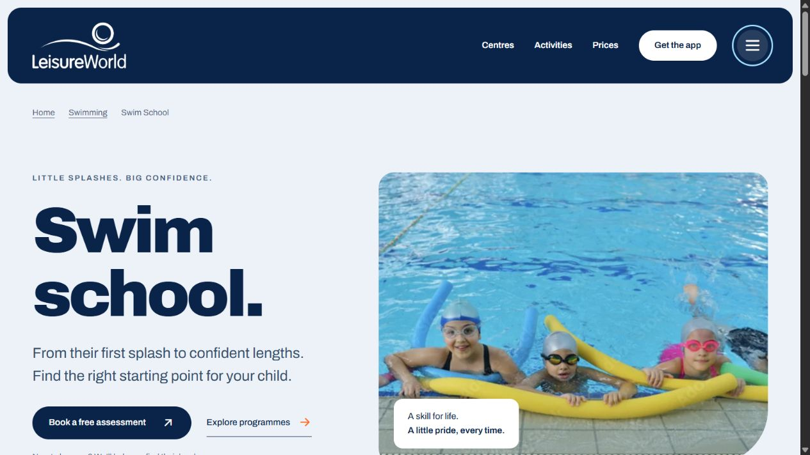
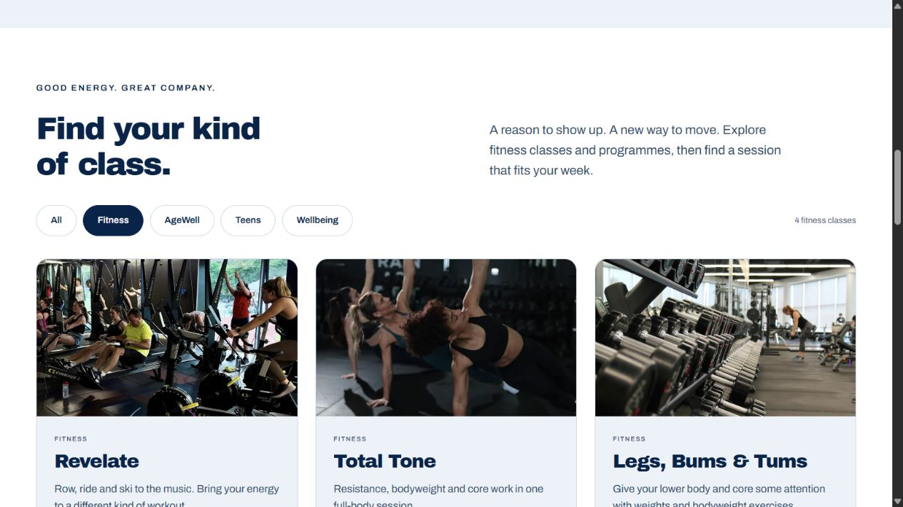
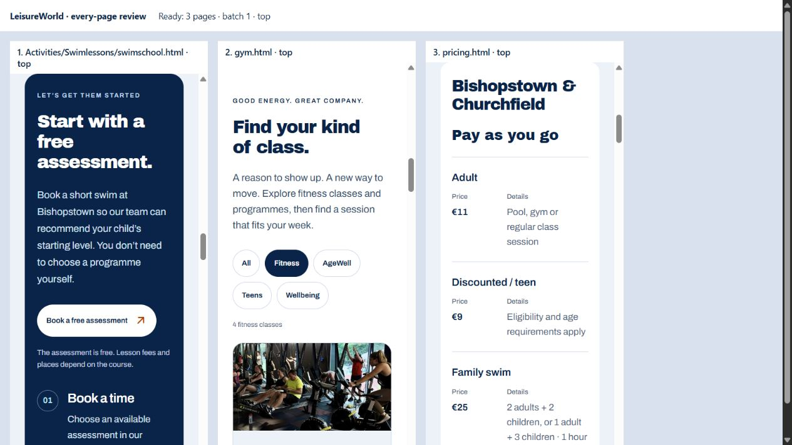

# Every-page visual refinement — 12 September 2026

This follow-up replaces the earlier review’s visual conclusions after the user identified Swim School as weak and reconfirmed the scope: **every page**. All 38 public pages were inspected again. Thirty received design or flow changes; the approved homepage, centre pages and other successful layouts were retained after review.

## What changed

- Swim School and its programme pages now feel like one family: bright photography, visible suitability/progression, a distinct free-assessment route and centre-specific help.
- Adult lessons, training, About and Careers have clearer introductions, stronger imagery and more purposeful content layouts.
- Gym class cards give photographs and descriptions room. Membership options make centre differences clear. All pricing data stays visible on small screens in labelled rows.
- The app landing has one clear introduction. Help prioritises search. Contact routes preselect the relevant centre/topic. Policy contents collapse on phones so long navigation lists do not delay reading.

App booking remains the main visit conversion. Assessments, course enquiries, membership joining and assistance retain the appropriate action for the page. No speculative schedules, availability, fees, endorsements or conversion results were added.

## Rendered evidence

Fresh desktop and 390px phone captures cover every page’s introduction, main content and ending. Dedicated 320px views cover assessment, class discovery and price rows. Saved captures were reopened and inspected. Early gallery captures with compositor image/edge artefacts are diagnostic only; direct and stable targeted captures are the accepted evidence below.

The complete working captures and before copies are in `.impeccable/second-pass/`, excluded from deployment. Swim School’s pre-rebuild copies are in `.impeccable/swim-school-refinement/`.

## Current verification

- 304 final checks: 38 pages × 1267, 768, 390 and 320px × normal/expanded WCAG text spacing. Zero detected axe violations, overflow, broken images or hero/header overlaps. Expandable content was opened for the checks.
- Keyboard checks: all five gym filters; Swim School FAQ; menu opening, Escape and focus return; policy contents and a section link; help empty state, reset and lesson filtering.
- Churchfield lesson enquiry preselection and empty-form validation checked. No actual enquiry was sent. Policy contents work with scripts blocked; all 16 help answers remain available.
- Static validation: 38 pages, 2,436 local references, zero errors. JavaScript syntax and Git whitespace checks pass. All 12 policy bodies remain text-identical to their before copies.
- All 38 routes are reachable from the homepage through local links. Canonicals, social metadata, structured breadcrumbs, five course entities, five directory lists, sitemap and optional discovery directory were regenerated and checked.

The target remains WCAG 2.2 AA. Automated and selected keyboard checks do not establish full conformance or legal compliance. Full assistive-technology/user evaluation and the external booking, payment, app and production mail journeys remain outside this verified scope. See [accessibility assessment limits](accessibility-review.md). AI discovery work supports readable, well-linked facts and structured meaning; it cannot guarantee citations or rankings.

## Every-page decision

| Page | Visitor task | Next step and visual/flow decision |
| --- | --- | --- |
| [about.html](../about.html) | Understand LeisureWorld’s community role | Choose a centre  Replaced the repeated dark pool hero with a light community introduction and welcoming photograph; strengthened the route to the three centres. |
| [accessibility.html](../accessibility.html) | Plan facility access or understand the Functional Zone | Contact a centre or discuss the HSE referral route  Added direct visit-planning and Functional Zone routes, improved the referral section and aligned assistance actions. Referral meaning retained. |
| [Activities/Swimlessons/rl.html](../Activities/Swimlessons/rl.html) | Explore junior lifesaving skills | Book an assessment  Light programme hero; visible lifesaving learning areas; distinct assessment panel and a preselected Bishopstown enquiry. |
| [Activities/Swimlessons/ss.html](../Activities/Swimlessons/ss.html) | Understand advanced swimming progression | Book an assessment or discuss progression  Light programme hero; visible skills and group information; clearer assessment and progression routes. |
| [Activities/Swimlessons/swimschool.html](../Activities/Swimlessons/swimschool.html) | Choose a children’s lesson starting point | Book a free assessment  Rebuilt the page: split photo hero, large programme cards, dedicated assessment steps, three centre contacts, parent FAQs and an iPhone app section. |
| [Activities/Swimlessons/wsf.html](../Activities/Swimlessons/wsf.html) | Understand the beginner swimming programme | Book an assessment  Light programme hero; four visible stages from Starfish to Dolphins; assessment and other-centre links. |
| [Activities.html](../Activities.html) | Choose an activity | Swimming, gym/classes or lessons  Retained the approved photographic hub, six-choice activity finder and app download section; reviewed discovery and conversion layout at desktop and phone widths. |
| [adultswimlesson.html](../adultswimlesson.html) | Choose adult or individual swimming lessons | Check courses or contact the teaching team  Light swimming hero, three visible starting options, stronger course-booking panel and targeted lesson enquiries. |
| [appfunnel.html](../appfunnel.html) | Get set up to book on a phone | Download the app or open browser booking  Consolidated the duplicate introductions into one headline beside the iPhone and app-store actions. Setup steps, FAQs and browser alternative retained. |
| [careers.html](../careers.html) | Explore working with LeisureWorld | View current vacancies or training  Replaced the repeated pool hero with an editorial workplace image and clearer vacancy/training actions; improved role and training cards. |
| [centre-policies.html](../centre-policies.html) | Find the relevant visitor or corporate policy | Read an HTML policy  Added four group shortcuts and clearer document cards with distinct accessible link names. |
| [Centres/bishopstown.html](../Centres/bishopstown.html) | Plan a visit to this centre | Check facilities, current schedules, directions and booking  Retained the approved light centre layout, panorama, facility links and app-first visit flow after visual review. |
| [Centres/churchfield.html](../Centres/churchfield.html) | Plan a visit to this centre | Check facilities, current schedules, directions and booking  Retained the matching light centre layout and app-first flow. The removed question callout remains absent. |
| [Centres/douglas.html](../Centres/douglas.html) | Plan a visit to this centre | Check facilities, current schedules, directions and booking  Retained the matching light layout and pool-specific information. Reviewed timetable, reception and app routes. |
| [centres.html](../centres.html) | Choose a centre by facilities and location | Open the relevant centre page  Retained the photographic directory and clear three-centre comparison. Reviewed all centre links and visit/app sections. |
| [Certfictaons/Cert.html](../Certfictaons/Cert.html) | Choose a training route | NPLQ or assistant swim teaching  Replaced plain training columns with two photographic course cards and a direct course comparison action. |
| [Certfictaons/nplq.html](../Certfictaons/nplq.html) | Check lifeguard training suitability | Read current dates and booking details  Added a clear lifeguard-training hero and immediate current-course action; converted prerequisites to a scannable checklist. |
| [Certfictaons/ws.html](../Certfictaons/ws.html) | Explore assistant swim teacher training | Enquire about the next course  Added a clear teacher-training hero, practical learning cards and a preselected Bishopstown training enquiry. |
| [contact.html](../contact.html) | Reach the right centre or send an enquiry | Phone, email or submit the labelled form  Separated centre contacts into readable cards, gave centre links distinct accessible names, and checked preselection and empty-form validation. |
| [gym.html](../gym.html) | Explore gyms and filter fitness classes | Book in the app; arrange teen induction with reception  Replaced narrow class thumbnails with full-width photographs and larger cards; retained and keyboard-tested all five filters; targeted programme enquiries. |
| [help.html](../help.html) | Resolve a practical visitor question | Search/filter answers, then follow the relevant next step  Prioritised search in a clear panel; kept categories, answers and contextual actions. Tested empty/reset/category states and no-script content. |
| [index.html](../index.html) | Discover LeisureWorld and book a visit | App downloads, with browser booking as an alternative  Retained the approved Welcome to LeisureWorld hero, centre shortcuts, app funnel, activity discovery and membership flow; reviewed all sections on desktop and mobile. |
| [membershipfunnel.html](../membershipfunnel.html) | Compare payment and membership options | Online sign-up for Bishopstown/Churchfield; contact Douglas  Made the two-centre/Douglas distinction visible before the plans, strengthened plan hierarchy and preselected Douglas membership enquiries. |
| [Policies/admission-policy.html](../Policies/admission-policy.html) | Read admission policy | Follow section navigation or request another format  Added a direct Read this document action and a compact, keyboard-operable contents panel on phones. Reviewed reading layout and support/return routes; policy body is unchanged. |
| [Policies/child-safeguarding-statement.html](../Policies/child-safeguarding-statement.html) | Read child safeguarding statement | Follow section navigation or request another format  Added a direct Read this document action and a compact, keyboard-operable contents panel on phones. Reviewed reading layout and support/return routes; policy body is unchanged. |
| [Policies/code-of-conduct-gym.html](../Policies/code-of-conduct-gym.html) | Read gym & fitness class rules | Follow section navigation or request another format  Added a direct Read this document action and a compact, keyboard-operable contents panel on phones. Reviewed reading layout and support/return routes; policy body is unchanged. |
| [Policies/code-of-conduct-pool.html](../Policies/code-of-conduct-pool.html) | Read pool rules | Follow section navigation or request another format  Added a direct Read this document action and a compact, keyboard-operable contents panel on phones. Reviewed reading layout and support/return routes; policy body is unchanged. |
| [Policies/community-engagement-policy.html](../Policies/community-engagement-policy.html) | Read community engagement policy | Follow section navigation or request another format  Added a direct Read this document action and a compact, keyboard-operable contents panel on phones. Reviewed reading layout and support/return routes; policy body is unchanged. |
| [Policies/customer-charter.html](../Policies/customer-charter.html) | Read customer charter | Follow section navigation or request another format  Added a direct Read this document action and a compact, keyboard-operable contents panel on phones. Reviewed reading layout and support/return routes; policy body is unchanged. |
| [Policies/disability-inclusion-policy.html](../Policies/disability-inclusion-policy.html) | Read disability inclusion policy | Follow section navigation or request another format  Added a direct Read this document action and a compact, keyboard-operable contents panel on phones. Reviewed reading layout and support/return routes; policy body is unchanged. |
| [Policies/environmental-policy.html](../Policies/environmental-policy.html) | Read environmental policy | Follow section navigation or request another format  Added a direct Read this document action and a compact, keyboard-operable contents panel on phones. Reviewed reading layout and support/return routes; policy body is unchanged. |
| [Policies/gender-pay-gap-2025.html](../Policies/gender-pay-gap-2025.html) | Read gender pay gap report 2025 | Follow section navigation or request another format  Added a direct Read this document action and a compact, keyboard-operable contents panel on phones. Reviewed reading layout and support/return routes; policy body is unchanged. |
| [Policies/sauna-steam-room-guidelines.html](../Policies/sauna-steam-room-guidelines.html) | Read sauna & steam room guidelines | Follow section navigation or request another format  Added a direct Read this document action and a compact, keyboard-operable contents panel on phones. Reviewed reading layout and support/return routes; policy body is unchanged. |
| [Policies/terms-and-conditions.html](../Policies/terms-and-conditions.html) | Read terms & conditions | Follow section navigation or request another format  Added a direct Read this document action and a compact, keyboard-operable contents panel on phones. Reviewed reading layout and support/return routes; policy body is unchanged. |
| [Policies/tips-and-gratuities-policy.html](../Policies/tips-and-gratuities-policy.html) | Read tips & gratuities policy | Follow section navigation or request another format  Added a direct Read this document action and a compact, keyboard-operable contents panel on phones. Reviewed reading layout and support/return routes; policy body is unchanged. |
| [poolactivities.html](../poolactivities.html) | Find a suitable pool activity | Book a session or choose a lesson route  Retained the approved pool hero, centre choices, lesson/Aquafit routes, visitor guidance and app booking section after visual review. |
| [pricing.html](../pricing.html) | Find a price for the right centre and activity | Compare membership or book a session  Added direct price-group choices. Reflowed all price tables into labelled rows on phones while preserving table semantics and desktop comparisons; removed a duplicate membership action. |
| [website-accessibility.html](../website-accessibility.html) | Understand website access and report a barrier | Email or call for assistance  Retained the readable statement, honest assessment limits and direct feedback routes after desktop/mobile review. |

Evidence: [final automated and interaction results](design-refinement-audit.json). Earlier findings remain in [the previous review](comprehensive-review.md), but its visual sign-off is superseded by this follow-up. No commit, push or deployment was performed.
